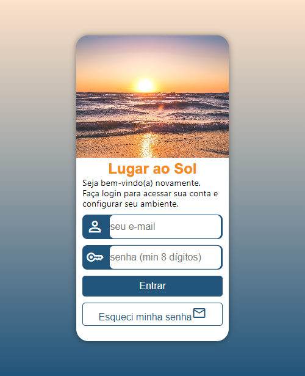
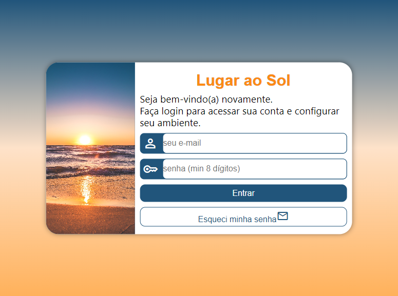
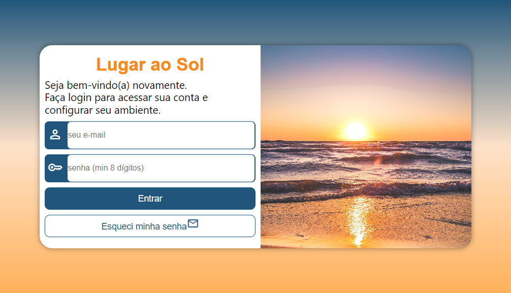

# Projeto Tela de Login
 
 Nesse projeto simulei uma tela de login utilizando a filosofia Mobile Frist através de Media Queries, com temática paradisíaca, fiz uso cores que remetem a tranquilidade e bem estar. Os campos de e-mail e senha são obrigatórios, porém no campo de senha é necessário ser preenchido com no mínimo 8 caracteres.
 Trata-se de um trabalho pessoal 100% responsivo e atrativo visualmente, espero que apreciem.

Link para acessa-lo: https://developeryago.github.io/projeto-tela-de-login/
